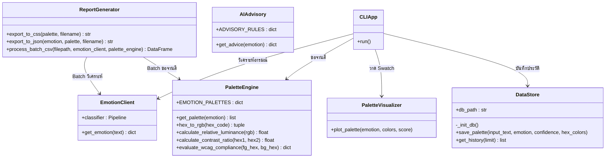

# 📋 PLAN.md — Smart Art & Palette Sentiment Analyzer Project Architecture & Planning Document

**โปรเจกต์:** Smart Art & Palette Sentiment Analyzer — ระบบวิเคราะห์อารมณ์จากข้อความและสร้างจานสีอัจฉริยะ
**รายวิชา:** CP352301 การเขียนโปรแกรมสคริปต์ (1/2569)
**อาจารย์ผู้สอน:** ผศ. บุญสืบ ไวคำ

---

## 👥 สมาชิกในทีมและบทบาทหมุนเวียน

| สมาชิก | Sprint 1 | Sprint 2 | Sprint 3 | Final |
| :--- | :--- | :--- | :--- | :--- |
| นายกฤษฎา สายวัน (กาย) | Planner | Coder | Debugger | Coder |
| นายปฏิภาณ นามสีลี (ท็อป) | Coder | Planner | Coder | Debugger |
| นายปฏิพัฒน์ หอทอง (ปลั๊ก) | Coder | Debugger | Coder | Planner |
| นายภีรภัทร ด่านภูมิพัฒนา (ภีม) | Debugger | Coder | Planner | Coder |

---

## 🏗️ UML Class Diagram (สถาปัตยกรรมเชิงวัตถุ)



---

## 🗃️ Data Schema

### SQLite — ตาราง `palette_history` (Local Persistence)

| คอลัมน์ | ประเภท | คำอธิบาย |
| :--- | :--- | :--- |
| `id` | INTEGER PRIMARY KEY AUTOINCREMENT | รหัสเรคอร์ด |
| `input_text` | TEXT NOT NULL | ข้อความที่ผู้ใช้กรอก |
| `predicted_emotion` | TEXT NOT NULL | อารมณ์ที่โมเดลทำนาย (เช่น joy, sadness) |
| `confidence_score` | REAL NOT NULL | ค่าความมั่นใจของโมเดล (0–1) |
| `hex_colors` | TEXT NOT NULL | จานสีเก็บเป็น JSON List เช่น `["#FFD166", "#FFFCF9", ...]` |
| `palette_size` | INTEGER DEFAULT 8 | จำนวนสีในจานสี |
| `created_at` | TIMESTAMP DEFAULT CURRENT_TIMESTAMP | วันเวลาที่บันทึก |

### Supabase Cloud — ตาราง `palette_history` (Cloud Migration)

โครงสร้างสอดคล้องกับ SQLite เพื่อให้ Sync ข้อมูลได้โดยตรง

| คอลัมน์ | ประเภท | คำอธิบาย |
| :--- | :--- | :--- |
| `id` | BIGSERIAL PRIMARY KEY | รหัสเรคอร์ด |
| `input_text` | TEXT NOT NULL | ข้อความที่ผู้ใช้กรอก |
| `predicted_emotion` | TEXT NOT NULL | อารมณ์ที่โมเดลทำนาย |
| `confidence_score` | NUMERIC(5,4) NOT NULL | ค่าความมั่นใจของโมเดล |
| `hex_colors` | JSONB NOT NULL | จานสี (Array ของ Hex Code) |
| `palette_size` | INTEGER DEFAULT 8 | จำนวนสีในจานสี |
| `created_at` | TIMESTAMPTZ DEFAULT now() | วันเวลาที่บันทึก |

---

## ✅ Definition of Done (DoD) — แต่ละ Sprint

### Sprint 1: Core System Foundation & OOP CLI

- [x] สร้างโครงสร้าง OOP แยกโมดูลชัดเจน (`EmotionClient`, `PaletteEngine`, `PaletteVisualizer`, `CLIApp`)
- [x] โปรแกรมแสดงข้อความต้อนรับและรับคำสั่งต่อเนื่องด้วย `while True` loop
- [x] พิมพ์ `quit` หรือ `exit` (ตัวพิมพ์เล็กหรือใหญ่) แล้วโปรแกรมหยุดทำงานทันที
- [x] กด Enter โดยไม่พิมพ์ข้อความ ระบบแสดงคำเตือนและไม่พัง (Input Validation)
- [x] วิเคราะห์อารมณ์ 6 ประเภท และเรนเดอร์ Visual Swatches ได้ถูกต้องตามอารมณ์
- [x] มี Defensive Fallback Unwrapping ป้องกัน `TypeError` จาก Nested List
- [x] มี Unit Test เบื้องต้น (`tests/test_emotion_client.py`)

### Sprint 2: Persistence, Report & AI Advisory

- [x] จัดเก็บประวัติการวิเคราะห์ลง SQLite (`data/palette_history.db`) อัตโนมัติ
- [x] รองรับการ Migrate / Sync ข้อมูลไปยัง Supabase Cloud Database (PostgreSQL)
- [x] ส่งออกจานสีเป็นไฟล์ `.json` และ `.css` (CSS Variables)
- [x] Batch Processing อ่านไฟล์ `.csv` และสรุปผลเป็นชุดข้อมูลส่งออก
- [x] AI Design Advisory แนะนำชื่อธีม, Font Pairings และการนำไปใช้งานตามอารมณ์
- [x] Accessibility Checker คำนวณ WCAG 2.1 Contrast Ratio แสดงสถานะ PASS (AAA) / PASS (AA) / FAIL
- [x] เพิ่ม Unit Test ของ `palette_engine`, `data_store` และ `report_generator`

### Sprint 3: Web Dashboard & Deployment

- [x] Web Dashboard สไตล์ Glassmorphism UI (`web/index.html`)
- [x] รองรับ 2 ภาษา (TH/EN Toggle)
- [x] Image Mood Input สกัดโทนสีหลักจากรูปภาพ และเปรียบเทียบกับจานสีที่ระบบแนะนำ
- [x] ประมวลผลฝั่งเบราว์เซอร์ (Client-Side) ไม่พึ่ง Backend API ภายนอก
- [x] GitHub Pages Deployment (CI/CD) — `.github/workflows/deploy-web.yml`
- [x] โหมด `--cli`, `--batch`, `--web` ใน `main.py` ทำงานครบ

---

## 🏛️ สถาปัตยกรรมระบบ 3 ชั้น (3-Layer Architecture)

```text
┌─────────────────────────────────────────────────────┐
│              PRESENTATION LAYER                     │
│                                                     │
│  ┌──────────────┐  ┌─────────────────────────────┐  │
│  │  CLIApp       │  │  Web Dashboard (index.html) │  │
│  │  (cli_app.py) │  │  Glassmorphism UI + TH/EN   │  │
│  └──────┬───────┘  └──────────┬──────────────────┘  │
├─────────┼──────────────────────┼─────────────────────┤
│         │   BUSINESS LOGIC LAYER                    │
│         │                      │                    │
│  ┌──────▼───────┐  ┌──────────▼──────────────────┐  │
│  │ EmotionClient │  │ PaletteEngine + AIAdvisory  │  │
│  │ (NLP Gateway) │  │ (Color Mapping + WCAG)      │  │
│  └──────┬───────┘  └──────────┬──────────────────┘  │
│         │   ┌────────────────────────────────────┐  │
│         │   │ PaletteVisualizer + ReportGenerator│  │
│         │   │ (Swatch Render + Export/Batch)     │  │
│         │   └──────────────────┬─────────────────┘  │
├─────────┼──────────────────────┼─────────────────────┤
│         │   DATA ACCESS LAYER                       │
│         │                      │                    │
│  ┌──────▼───────┐  ┌──────────▼──────────────────┐  │
│  │  DataStore    │  │  Supabase Cloud Database    │  │
│  │  (SQLite3)    │  │  (PostgreSQL)               │  │
│  └──────────────┘  └─────────────────────────────┘  │
└─────────────────────────────────────────────────────┘
```

**หลักการออกแบบ:**

- **Separation of Concerns (SoC):** แต่ละโมดูลรับผิดชอบงานเดียว
- **Single Responsibility Principle (SRP):** ทุกคลาสมีหน้าที่เดียวชัดเจน
- **Defensive Programming:** ตรวจชนิดข้อมูลด้วย `isinstance`, ตรวจ Input ว่าง และดักจับ Exception ใน CLI Loop
- **Parameterized Queries:** ป้องกัน SQL Injection ด้วย `?` placeholder ใน `DataStore`

---

## 🔄 ประวัติการ Refactor โค้ด (Refactoring History)

| ลำดับ | โมดูลที่ Refactor | ปัญหาที่พบ (Issue) | วิธีการแก้ไข (Solution) | ผลลัพธ์ |
| :--- | :--- | :--- | :--- | :--- |
| RF-01 | `src/emotion_client.py` | Hugging Face คืนผลเป็น List ซ้อน List ทำให้เกิด `TypeError` | เพิ่มการตรวจ `isinstance(results[0], list)` แล้วจัดเรียงตาม score เลือกอันดับหนึ่ง | รองรับ Output ทั้งสองรูปแบบ ระบบไม่พัง |
| RF-02 | `src/cli_app.py` | กด Enter โดยไม่พิมพ์ข้อความ หรือกด Ctrl+C ทำให้โปรแกรมหยุดผิดปกติ | เพิ่ม Input Validation (`.strip()`, เช็คค่าว่าง) และ `try-except` สำหรับ `KeyboardInterrupt` / `Exception` | CLI ทำงานต่อเนื่อง ออกจากระบบอย่างสุภาพ |
| RF-03 | `src/palette_engine.py` | จานสี 5 สีไม่ครอบคลุมการใช้งานจริง (พื้นหลัง, ตัวอักษร, เส้นขอบ) | ขยายเป็นจานสี 8 สี พร้อมลำดับบทบาท (Primary, Secondary, Accent, Background, Text, Border) และ `get_palette` fallback เป็น `neutral` | จานสีใช้งานออกแบบ UI ได้จริง และรองรับอารมณ์ที่ไม่รู้จัก |
| RF-04 | `src/palette_engine.py` | ไม่มีการตรวจความอ่านง่ายของคู่สี | เพิ่ม `calculate_relative_luminance`, `calculate_contrast_ratio` และ `evaluate_wcag_compliance` ตามมาตรฐาน WCAG 2.1 | แจ้ง PASS (AAA) / PASS (AA) / FAIL ได้ |
| RF-05 | `src/data_store.py` | ประวัติหายเมื่อปิดโปรแกรม และเก็บจานสีเป็นสตริงอ่านยาก | สร้างตาราง SQLite อัตโนมัติ เก็บจานสีเป็น JSON และแปลงกลับด้วย `json.loads` ตอนดึงประวัติ | ดึงประวัติย้อนหลังได้ครบ จานสีกลับมาเป็น List |
| RF-06 | `src/report_generator.py` | นักพัฒนาต้องคัดลอกโค้ดสีด้วยมือ และประมวลผลทีละข้อความ | เพิ่ม `export_to_css`, `export_to_json` และ `process_batch_csv` | นำจานสีไปใช้ต่อได้ทันที และประมวลผลเป็นชุดได้ |

---

## 💡 สรุปบทเรียนประจำสัปดาห์ (Retrospective: Wow! & Whoops!)

### 🌟 Wow! (ส่วนที่ทำได้ดี)

- **Modular Layer Separation:** แยกโมดูลตามหน้าที่ (NLP, Color Engine, Visualizer, Data, Report) ทำให้สมาชิกหมุนเวียนบทบาทและทำงานคู่ขนานกันได้
- **Defensive Programming:** ตรวจชนิดข้อมูลและ Input ทุกจุดสำคัญ ทำให้ CLI ไม่ล่มเมื่อเจอข้อมูลผิดรูปแบบ
- **Full-Stack Extension:** ต่อยอดจาก Python CLI ไปสู่ Web Dashboard สไตล์ Glassmorphism ที่ประมวลผลฝั่งเบราว์เซอร์ และ Deploy บน GitHub Pages อัตโนมัติ

### ⚠️ Whoops! (ปัญหาที่พบและการแก้ไข)

- **Nested List `TypeError`:** Output ของโมเดล Hugging Face เป็น List ซ้อน List → แก้ด้วยการตรวจ `isinstance` และจัดเรียงตามค่า score
- **Empty Input:** ผู้ใช้กด Enter โดยไม่พิมพ์ข้อความ → เพิ่ม Input Validation แสดงคำเตือนแล้ววนรับข้อมูลต่อ
